# **Zevihanthosa - Advanced Artificial Intelligence Framework**  


## ZevihaNut/3.0 Model (Latest Release - January 2026)
*A lightweight, pure-Python hybrid AI framework combining parametric neurons, non-parametric memory, safe symbolic regression, massively scaled localized ensembles, and Deep Multi-Layer Networks — now with significantly improved numerical stability, memory reset control, quantization-aware behavior, hierarchical lobe-based modularity, natural error-driven plasticity, and flexible meta-control over learning & forgetting.*

> 👉 **New Reader?**  
> Read the manifesto: **[WHATADIFF.md — What a Difference?](WHATADIFF.md)**

### Overview
**ZevihaNut/3.0** introduces major advances in stability, plasticity control and hierarchical structure while faithfully preserving the framework’s fundamental philosophy: extreme minimalism, fully online/incremental learning, complete serialization of the entire system, and a deeply hybrid parametric + non-parametric intelligence.

**Main novelties in ZevihaNut/3.0:**

- Introduction of the new **Brain** class — a hierarchical, multi-lobe architecture that allows different modules (lobes) to have distinct roles, learning dynamics, and plasticity profiles while sharing a unified backpropagation pass
- Completely revamped **forget** mechanism:  
  `.forget(force)` now accepts a continuous forget factor (0.0 = full reset, 1.0 = no change, 0.3 = strong but gradual forgetting, etc.)  
  → much finer meta-plasticity control across all cell types and higher structures
- New **learnrate** parameter propagated through the entire system + optional **naturalderiv** mode  
  When activated, updates become proportional to |error| → very strong, biologically-inspired adaptation to large errors
- Per-lobe plasticity modulation via `lobesset`  
  Each lobe can have independent trainrate and learnrate multipliers → allows creating fast-adapting sensory lobes, slow & stable conceptual lobes, conservative decision/output lobes, etc.
- Consistent propagation of new control parameters (`learnrate`, `naturalderiv`, `force`) across **all** levels:  
  single cells → forests → networks → multi-lobe Brain
- Significantly improved numerical and training stability for very deep, very wide or very long-running incremental/online learning scenarios

These changes move Zevihanthosa further toward a more modular, biologically plausible and controllable extreme-specialization system — while keeping the core principles of radical minimalism, full incrementality, complete serialization and hybrid parametric/non-parametric nature fully intact.

**Key Features of ZevihaNut/3.0**

- Pure Python & minimal dependencies (`random`, `math`, `json`, `ast`, `functools`)
- Fully online / incremental learning — true per-sample adaptation with no batch requirement
- Deep hierarchical backpropagation through arbitrary depth and modular structure
- Advanced momentum with exchange control (default 0.9)
- Automatic weight/bias clamping and numerical stability safeguards
- Rich & flexible activation family:  
  sigmoid, softsign, tanh, Swish, positive/negative linear, hard-cutoff linear variants, and the custom zevian/nom compression
- **Complete model persistence** — every component (cells, forests, networks, multi-lobe Brains) can be fully serialized to/from JSON, copied, saved, and restored
- Powerful per-component **plasticity & stability toolkit** available on every level:

  - `.forget(force)` — continuous forgetting factor (0.0 = full momentum reset, 1.0 = no change, 0.3 = strong gradual decay, etc.)
  - `.rmtolerance(sensitivity)` — intelligent snapping of near-integer values to exact integers (helps escape floating-point drift)
  - `.quantization(sensitivity)` — aggressive, tunable value discretization for long-term numerical robustness
- New **multi-lobe Brain** architecture — allows creating modular, biologically-inspired systems with:
  - Multiple specialized lobes (sensory, abstract, decision, etc.)
  - Independent trainrate & learnrate scaling per lobe
  - Differential plasticity profiles across the hierarchy
- Optional **naturalderiv** mode — makes learning rate scale dynamically with |error| for stronger, more adaptive updates on large mistakes
- Consistent propagation of new control parameters (`learnrate`, `naturalderiv`, `force`) through all layers of the system — from single cells to complete Brains
- **Learning Paradigms in ZevihaNut/3.0**  
1. Classic momentum neuron  
   → `Cell`  
2. Pure additive linear combiner  
   → `LinearSumCell`  
3. Pure multiplicative scaling unit  
   → `LinearMulCell`  
4. Non-parametric instance-based memory regressor  
   → `DataCell`  
5. Multi-input weighted fusion neuron  
   → `MultiInputCell`  
6. Single-input → parallel multi-output projector  
   → `MultiOutputCell`  
7. Full dense transformation layer (multi-in → multi-out)  
   → `MultiCell`  
8. Safe, AST-evaluated symbolic function approximator  
   → `FuncCell`  
9. Ultra-minimal perceptron (no momentum, direct updates)  
   → `NanoCell`  
10. Input-localized ensemble of single-input specialists  
    → `CellForest`  
11. Input-localized ensemble of full dense layers  
    → `MultiCellForest`  
12. Deep, backprop-trained multi-layer perceptron network  
    → `CellNetwork`  
13. Input-localized ensemble of complete deep networks  
    → `CellNetworkForest`  
14. Hierarchical multi-lobe brain with modular, differential plasticity  
    → `Brain`

- **High Interpretability** — readable symbolic expressions via FuncCell + fully persistent, inspectable JSON states  
- **Aggressive Numerical Control** — strong quantization, tolerance snapping & value compression tools  
- **Center-aware Localization** — sharp input-space clustering with distance-based specialist selection  
- **Anchor-based Ensemble Blending** — weighted blending emphasizing the single best-matching unit

### Core Components
#### 1. `Cell` — Classic Momentum-Optimized Neuron
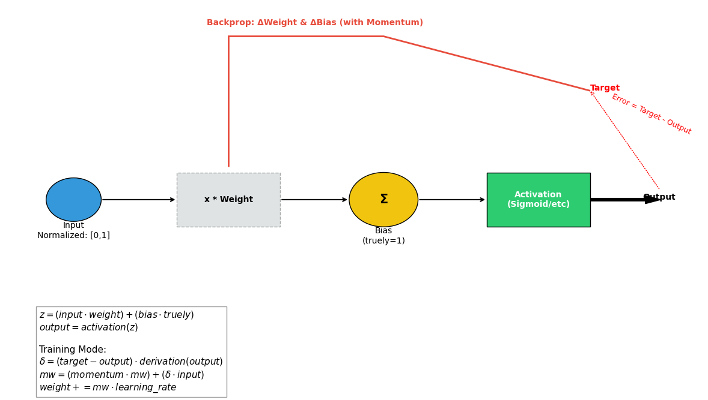

#### 2. `LinearSumCell` — `output = activation(input + bias)`
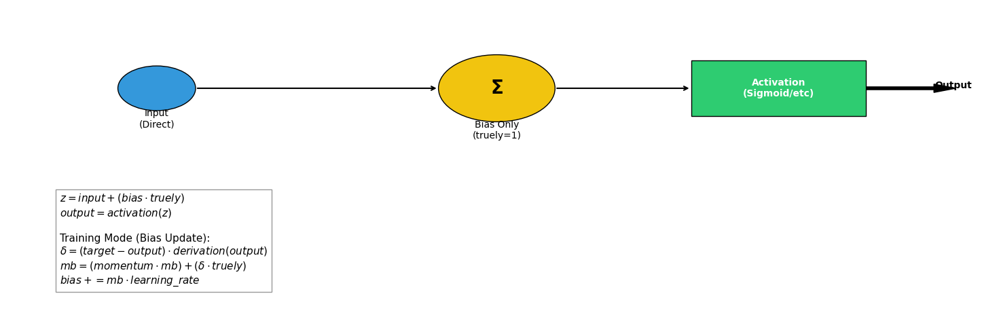

#### 3. `LinearMulCell` — `output = activation(input * weight)`
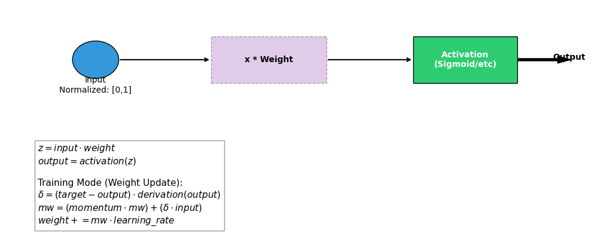

#### 4. `DataCell` — Distance-weighted memory-based prediction


#### 5. `MultiInputCell` — Multiple inputs → single output
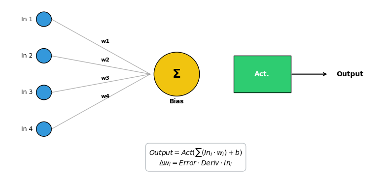

#### 6. `MultiOutputCell` — Single input → multiple outputs
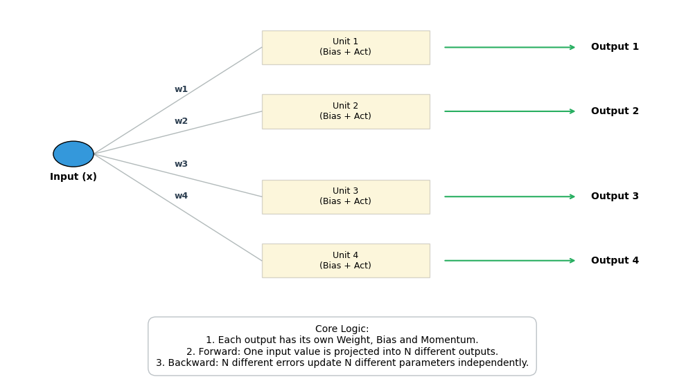

#### 7. `MultiCell` — Full arbitrary dense layer


#### 8. `FuncCell` — Safe symbolic regression (bounded arithmetic expressions)


#### 9. `NanoCell` — Lightweight perceptron (no momentum)
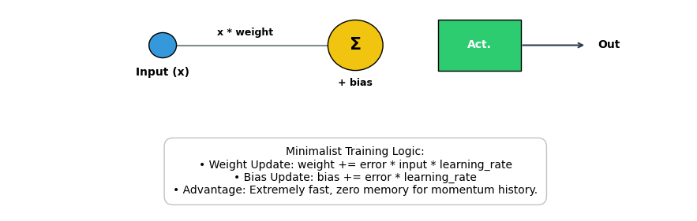

#### 10. `CellForest` — **Localized** ensemble of `Cell`s
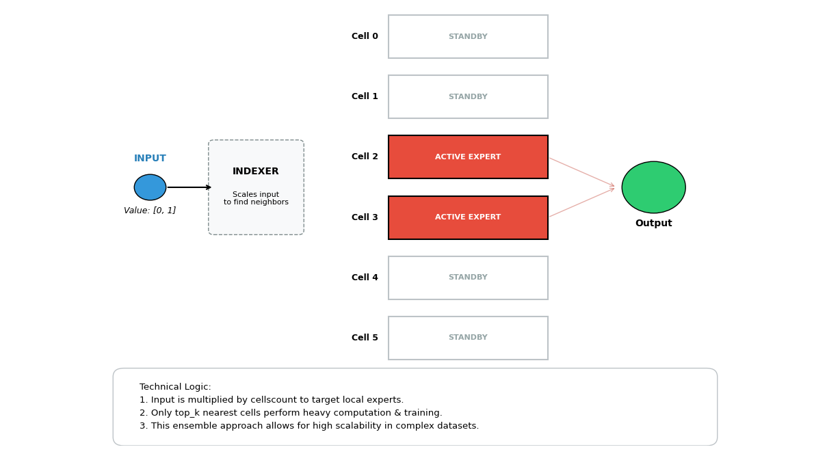

#### 11. `MultiCellForest` — **Localized** ensemble of `MultiCell`s
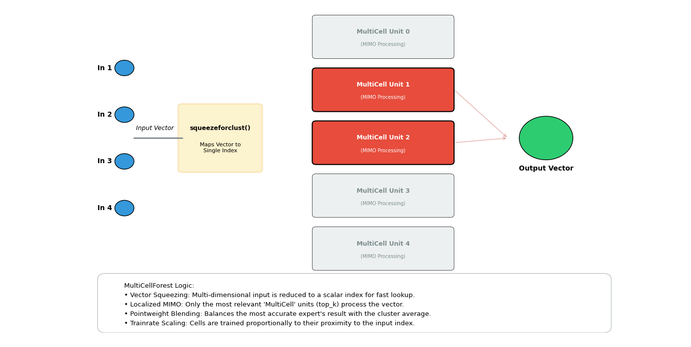

#### 12. `CellNetwork` — Multi-layer dense network with automated backpropagation and per-layer activations
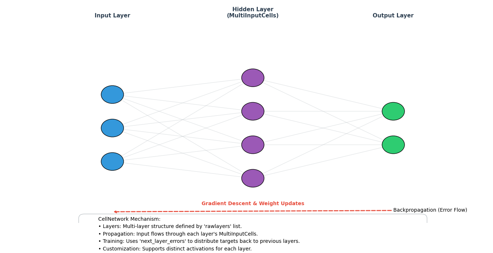

#### 13. `CellNetworkForest` — Localized ensemble of `CellNetwork`s
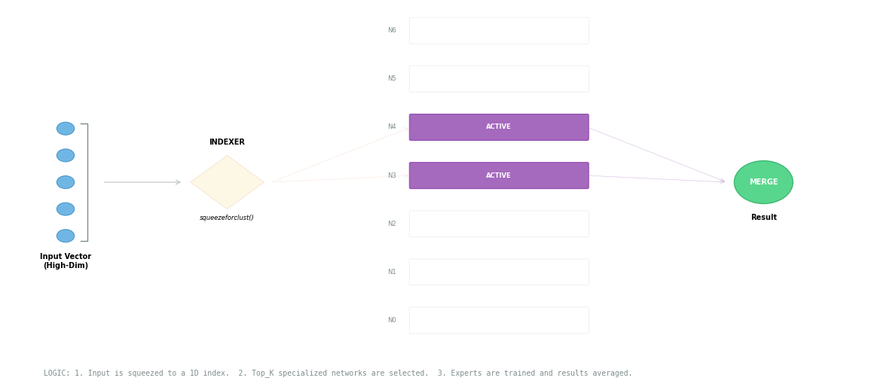

#### 14. `Brain` — Hierarchical Composition and Chain of `CellNetwork`s (Multi-Lobe Structure)
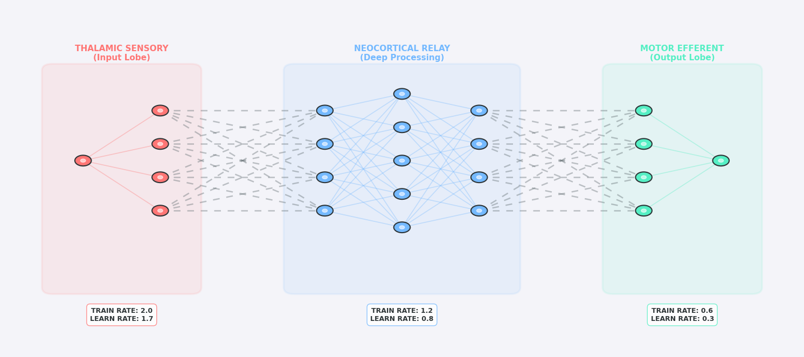

**New in ZevihaNut/3.0**

* **Hierarchical Multi-Lobe Brain Architecture**  
  Introduction of the powerful new `Brain` class — a true hierarchical composition of multiple `CellNetwork`s (now called "lobes") with unified backpropagation across the entire structure, enabling deep modular designs with biologically-inspired specialization.
* **Differential Plasticity & Modular Control**  
  Per-lobe plasticity tuning via `lobesset` — each lobe can have its own independent `trainrate` and `learnrate` multipliers, allowing fast-adapting sensory lobes, slow & stable conceptual lobes, and ultra-conservative output/decision lobes within the same model.
* **Continuous & Tunable Forgetting Mechanism**  
  Major upgrade: `.forget(force)` now accepts a continuous factor (0.0 = complete momentum reset, 1.0 = no change, 0.3 = strong gradual decay, etc.) — giving unprecedented fine-grained meta-plasticity control at every level of the hierarchy.
* **Natural Error-Proportional Updates**  
  Brand-new `naturalderiv` mode: when enabled, the effective learning rate scales dynamically with |error| → extremely strong adaptation to large mistakes, more biologically plausible gradient behavior, and better handling of sparse/outlier events.
* **Propagated Fine-Grained Learning Control**  
  New `learnrate` parameter flows consistently through the entire system — from individual cells → forests → networks → full multi-lobe Brains — allowing precise adjustment of update magnitudes at any depth.
* **Enhanced Long-Term Stability & Robustness**  
  All previous stabilization tools (`.rmtolerance`, `.quantization`, `.forget`) are now even more powerful and uniformly applied across the deeper, more complex hierarchical structures — making extremely long-running incremental learning sessions dramatically more reliable.
* **Improved Locality & Expert Synergy**  
  Retained and refined center-aware localization, anchor-dominant blending, top-k selection, and `squeezeforclust` routing — now operating seamlessly within the new multi-lobe hierarchy for even sharper specialization at multiple scales.

> [!TIP]  
> **ZevihaNut/3.0 – Towards the Most Realistic Artificial Brain**  
> 
> The new `Brain` class is the most significant milestone yet:  
> it is a **hierarchical, chained structure composed of specially tuned CellNetworks** (now called "lobes").  
> Each lobe can be independently configured for depth, width, activation behavior, learning dynamics and plasticity profile — allowing the creation of modular, biologically-plausible brain-like hierarchies.
> 
> **Core mission reminder**  
> Zevihanthosa was never designed for conventional industrial-scale machine learning.  
> Its ultimate goal is to build **the most realistic possible artificial brain** — an extremely specialized, incremental, hybrid (parametric + non-parametric) system that mimics biological neural organization as closely as current minimalistic tools allow.
> 
> **Important reality about Brain usage**  
> When used carefully — with thoughtful lobe arrangement, precise plasticity settings (`lobesset`), naturalderiv mode, and continuous forgetting — `Brain` can produce strikingly realistic, deeply non-linear, context-sensitive behavior.  
> However, if misused (wrong lobe ordering, mismatched plasticity profiles, over-aggressive learning, or treating it like a standard feed-forward net), it tends to **regress toward linear-like behavior** — losing the very non-linearity and specialization that make it special.
> 
> In other words:  
> A well-tuned Brain can feel disturbingly "alive" and adaptive.  
> A poorly tuned Brain quickly becomes just another (very expensive) linear regressor.
> 
> **Resolved limitations from previous versions**  
> All major bottlenecks from 2.9 have been addressed and extended to support the new hierarchical reality:
> - Scalability: forest_depth + multi-lobe design allows very deep yet manageable architectures  
> - Performance: enhanced squeezeforclust routing + top-k + anchor dominance = fast & precise expert selection even at brain scale  
> - Tuning simplicity: intuitive per-lobe plasticity control (`lobesset`) replaces many previous magic numbers  
> - High-dimensional robustness: improved clustering and compression tools handle complex, multi-feature inputs natively  
> 
> Thank you for following Zevihanthosa's journey.  
> Version 3.0 is not just an incremental update — it is the first serious step toward something that might one day resemble a true artificial mind.  
> But as always: with great realism comes great responsibility in how you tune and use it. 🧠

Thank you for following Zevihanthosa development — 3.0 represents a bold step toward expert specialization.

---

### Installation

```bash
git clone https://github.com/aertsimon90/Zevihanthosa.git
cd Zevihanthosa
# Import zevihanthosa.py directly into your project

```

No pip install required.

### Usage Examples

```python
from zevihanthosa import *
import random
import math

random.seed(42) # stability

# 1. Cell – learning a threshold
cell = Cell(learning=0.15)
for _ in range(12000):
    x = random.random()
    target = 1.0 if x > 0.7 else 0.0
    cell.process(x, target)
print("Cell at 0.6 →", cell.process(0.6, train=False))
print("Cell at 0.8 →", cell.process(0.8, train=False))

# 2. DataCell – adaptive averaging / denoising
dc = DataCell(maxdatac=100)
for i in range(300):
    noisy = 0.5 + random.gauss(0, 0.12)
    dc.process(noisy, target=0.5)
print("Current smooth estimate:", dc.process(0.7, train=False))

# 3. MultiInputCell – learning harmonic mean approximation
mi = MultiInputCell(wcount=2, learning=0.08)
for _ in range(30000):
    a = random.randint(1, 10)
    b = random.randint(1, 10)
    mi.process([1/a, 1/b], target=1/(a + b))  # 1/x normalization for 0-1 range
print("MultiInputCell approx 1/(7+2) from [1/7, 1/2]:", 1/mi.process([1/7, 1/2], train=False))

# 4. MultiOutputCell – predicting x² and √x from x
mo = MultiOutputCell(pcount=2, learning=0.1)
for _ in range(20000):
    x = random.uniform(0, 1)
    target1 = x ** 2
    target2 = math.sqrt(x)
    mo.process(x, target=[target1, target2])
print("x = 0.0 → (x², √x):", mo.process(0.0, train=False))
print("x = 0.25 → (x², √x):", mo.process(0.25, train=False))
print("x = 0.5 → (x², √x):", mo.process(0.5, train=False))
print("x = 1.0 → (x², √x):", mo.process(1.0, train=False))

# 5. FuncCell – discovering square root
fc = FuncCell(traindepth=2)
for x in [0,1,4,9,16]:
    y = math.sqrt(x)
    fc.process(x, target=y)
print("Discovered function:", fc.func)
print("Test on x=3 →", fc.process(3, train=False))

# 6. MultiCell – dividing the sum of two numbers by three (equal share to each output) test (new in 2.3)
mc = MultiCell(icount=2, ocount=3, learning=0.15)
for _ in range(30000):
    a = random.uniform(0.0, 1.0)
    b = random.uniform(0.0, 1.0)
    total = a + b
    third = total / 3.0
    mc.process([a, b], target=[third, third, third])
print("Input [0.0, 0.0] →", mc.process([0.0, 0.0], train=False))      # expected: [0.0, 0.0, 0.0]
print("Input [0.3, 0.3] →", mc.process([0.3, 0.3], train=False))      # expected: [0.2, 0.2, 0.2]
print("Input [0.5, 0.6] →", mc.process([0.5, 0.6], train=False))      # expected: ≈[0.3667, 0.3667, 0.3667]
print("Input [1.0, 1.0] →", mc.process([1.0, 1.0], train=False))      # expected: ≈[0.6667, 0.6667, 0.6667]
print("Input [0.2, 0.8] →", mc.process([0.2, 0.8], train=False))      # expected: ≈[0.3333, 0.3333, 0.3333]

# 7. New: CellForest – smooth approximation of complex 1D function
cf = CellForest(cellscount=64, learning=0.12)
for _ in range(40000):
    x = random.random()
    y = math.sin(x * 10) / 2 + 0.5  # fast oscillating wave
    cf.process(x, target=y, top_k=2)
print("CellForest sin-approx at x=0.1 →", cf.process(0.1, train=False, top_k=2)) # expected: 0.9207354924039483
print("CellForest sin-approx at x=0.9 →", cf.process(0.9, train=False, top_k=2)) # expected: 0.7060592426208783

# 8. MultiCellForest – robust approximation of complex 2D function (simplified for better convergence)
mcf = MultiCellForest(cellscount=32, icount=2, ocount=1, learning=0.08)
for i in range(50000):
    x = random.random()
    y = random.random()
    target = (math.sin(x * 5) + math.cos(y * 5)) / 4 + 0.5  # simpler 2D oscillation (lower frequency, easier to learn)
    mcf.process([x, y], target=[target], top_k=2)
print("MultiCellForest at [0.1, 0.2] →", mcf.process([0.1, 0.2], train=False, top_k=2)[0]) # expected: 0.7549319611180857
print("MultiCellForest at [0.9, 0.8] →", mcf.process([0.9, 0.8], train=False, top_k=2)[0]) # expected: 0.09220656536782279
print("MultiCellForest at [0.5, 0.5] →", mcf.process([0.5, 0.5], train=False, top_k=2)[0]) # expected: 0.4493321321392557
print("MultiCellForest at [0.0, 1.0] →", mcf.process([0.0, 1.0], train=False, top_k=2)[0]) # expected: 0.5709155463658065

# 9. CellNetwork – Learning a Continuous Sine Wave Mapping
# Architecture: 1 input (x) -> 16 hidden neurons -> 1 output (sin(x))
# We use more hidden neurons to capture the curvature of the wave.
net_sine = CellNetwork(layers=[1, 16, 1], learning=0.05)

print("Training CellNetwork on Sine Wave...")
for i in range(150000):
    # Training range: 0 to 2*PI, normalized to 0-1 for stability
    x_val = random.random() 
    # Target: sin(x) mapped from [-1, 1] to [0, 1] range for neural stability
    target_sin = (math.sin(x_val * math.pi * 2) + 1.0) / 2.0
    net_sine.process([x_val], target=[target_sin])

# --- Comprehensive Sine Wave Inference & Accuracy Report ---
test_points = [
    (0.00, "0°"),      # Expected: 0
    (0.125, "45°"),    # Expected: 0.707
    (0.25, "90°"),     # Expected: 1
    (0.50, "180°"),    # Expected: 0
    (0.75, "270°"),    # Expected: -1
    (1.00, "360°")     # Expected: 0
]

print("--- Zevihanthosa CellNetwork: Sine Wave Accuracy Report ---")
total_acc = 0
for x_norm, label in test_points:
    # Get raw prediction [0, 1]
    raw_out = net_sine.process([x_norm], train=False)[0]
    # Map back to [-1, 1]
    predicted_val = (raw_out * 2.0) - 1.0
    # Calculate real value
    actual_val = math.sin(x_norm * math.pi * 2)
    # Calculate error and accuracy percentage
    error = abs(actual_val - predicted_val)
    # Accuracy: 100% minus the error percentage (relative to range 2.0)
    accuracy = max(0, (1.0 - (error / 2.0)) * 100)
    total_acc += accuracy
    
    print(f"Angle: {label:^5} | Pred: {predicted_val:7.4f} | Real: {actual_val:7.4f} | Error: {error:.6f} | Acc: {accuracy:.2f}%")

print(f"Overall CellNetwork Model Consistency: {(total_acc / len(test_points)):.2f}%")

# 10. CellNetworkForest – Ensemble of deep networks for robust 2D function approximation
# (new in 2.7 – stabilized deep forest architecture, handling multi-dimensional inputs)
# Task: Learn sin(2πx) * cos(2πy) + noise (harder, non-linear 2D interaction like modulated waves)
cnf = CellNetworkForest(
    networkcount=24, 
    layers=[2, 12, 1],  # 2 inputs (x,y) → 12 hidden → 1 output
    learning=0.04,
)

print("Training CellNetworkForest (CNF) on Noisy 2D Modulated Wave...")
# Training data: complex 2D surface with gaussian noise for challenge
for i in range(50000):
    x_val = random.random()
    y_val = random.random()
    # Target: sin(2πx) * cos(2πy) – non-separable, oscillatory 2D function
    raw_target = math.sin(x_val * math.pi * 2) * math.cos(y_val * math.pi * 2)
    # Add noise to simulate real-world data imperfection
    noisy_raw = raw_target + random.gauss(0, 0.1)
    # Normalize to [0,1] for framework stability
    target_val = max(0.0, min(1.0, (noisy_raw + 1.0) / 2.0))
    cnf.process([x_val, y_val], target=[target_val], top_k=2)

# --- Comprehensive 2D Modulated Wave Inference & Accuracy Report (comparison) ---
# Test points chosen for diverse regions: peaks, troughs, and interactions
test_points = [
    ([0.00, 0.00], "(0,0)"),     # Expected raw: sin(0)*cos(0) = 0*1 = 0 → norm ~0.5
    ([0.25, 0.00], "(90°,0°)"),  # Expected: 1*1 = 1 → norm 1.0
    ([0.50, 0.25], "(180°,90°)"),# Expected: 0*0 = 0 → norm 0.5
    ([0.75, 0.50], "(270°,180°)"),# Expected: (-1)*(-1) = 1 → norm 1.0
    ([0.00, 0.75], "(0°,270°)"), # Expected: 0*0 = 0 → norm 0.5
    ([1.00, 1.00], "(360°,360°)"),# Expected: 0*1 = 0 → norm 0.5
]

print("--- Zevihanthosa CellNetworkForest (CNF – localized ensemble network) Accuracy ---")
total_acc_cnf = 0
for inputs, label in test_points:
    raw_out = cnf.process(inputs, train=False, top_k=2)[0]
    predicted_raw = (raw_out * 2.0) - 1.0  # Denormalize
    actual_raw = math.sin(inputs[0] * math.pi * 2) * math.cos(inputs[1] * math.pi * 2)
    error = abs(actual_raw - predicted_raw)
    accuracy = max(0, (1.0 - (error / 2.0)) * 100)
    total_acc_cnf += accuracy
    print(f"Point: {label:^10} | Pred: {predicted_raw:7.4f} | Real: {actual_raw:7.4f} | Error: {error:.6f} | Acc: {accuracy:.2f}%")

print(f"Overall CNF (Network Forest) Consistency: {total_acc_cnf / len(test_points):.2f}%")

# 11. Brain – Simple Hierarchical Example
# Why a basic example? Because the brain class requires complex training processes to perform more difficult tasks.
print("--- Brain: Simple Hierarchical Example ---")

brain = Brain(
    lobes=[
        [1, 16],       # Lobe 1: Fast sensory layer (wide & quick)
        [16, 1]        # Lobe 2: Decision layer (deeper & stable)
    ]
)

# Lobe 1 learns fast, Lobe 2 stays slow and stable
brain.lobesset = [
    [2.0, 1.4],   # Fast lobe
    [0.8, 0.7]    # Slow & stable lobe
]

# Task: Learn the simple quadratic function x²
print("Brain learning x² function...")
for _ in range(50000):
    x = random.random()
    target = x * x           # Target: x² (already in [0,1])
    brain.process([x], target=[target]) # you can use naturalderiv=True for more complex tasks

# Test results with accuracy
print("Test Results (x → x²)")
print("x     | Predicted | Real       | Difference | Accuracy")
print("-" * 55)
total_accuracy = 0
test_points = [0.0, 0.2, 0.4, 0.6, 0.8, 1.0]
for x in test_points:
    pred = brain.process([x], train=False)[0]
    real = x * x
    diff = pred - real
    accuracy = max(0, (1 - abs(diff)) * 100)
    total_accuracy += accuracy
    print(f"{x:.1f}   | {pred:.4f}    | {real:.4f}    | {diff:+.4f}   | {accuracy:5.1f}%")
avg_accuracy = total_accuracy / len(test_points)
print(f"Overall Average Accuracy: {avg_accuracy:.1f}%")
```

### Example Output

```
Cell at 0.6 → 0.032449743937126636
Cell at 0.8 → 0.964736878960268
Current smooth estimate: 0.5
MultiInputCell approx 1/(7+2) from [1/7, 1/2]: 9.154347961916285
x = 0.0 → (x², √x): [0.012386497402471207, 0.2328382855556689]
x = 0.25 → (x², √x): [0.057940683286017716, 0.46887922475357646]
x = 0.5 → (x², √x): [0.23172214712064113, 0.7197183591024585]
x = 1.0 → (x², √x): [0.8788366685322571, 0.955996432844036]
Discovered function: x**2**-1
Test on x=3 → 1.7320508075688772
Input [0.0, 0.0] → [0.08764712160414166, 0.08971296219786976, 0.09038442506505527]
Input [0.3, 0.3] → [0.19918553864873334, 0.20107283752326818, 0.2019345723093016]
Input [0.5, 0.6] → [0.35441220242318905, 0.3546675829614651, 0.3554343762404322]
Input [1.0, 1.0] → [0.6960045996154952, 0.6916822536868388, 0.6914117042180881]
Input [0.2, 0.8] → [0.31786344456514853, 0.319476769198645, 0.32069871924780047]
CellForest sin-approx at x=0.1 → 0.9119575184998867
CellForest sin-approx at x=0.9 → 0.6914212261446739
MultiCellForest at [0.1, 0.2] → 0.7611578047035364
MultiCellForest at [0.9, 0.8] → 0.10671033969829927
MultiCellForest at [0.5, 0.5] → 0.387072592260856
MultiCellForest at [0.0, 1.0] → 0.5733994449097569
Training CellNetwork on Sine Wave...
--- Zevihanthosa CellNetwork: Sine Wave Accuracy Report ---
Angle:  0°   | Pred:  0.0927 | Real:  0.0000 | Error: 0.092746 | Acc: 95.36%
Angle:  45°  | Pred:  0.7472 | Real:  0.7071 | Error: 0.040120 | Acc: 97.99%
Angle:  90°  | Pred:  0.9317 | Real:  1.0000 | Error: 0.068326 | Acc: 96.58%
Angle: 180°  | Pred:  0.0076 | Real:  0.0000 | Error: 0.007556 | Acc: 99.62%
Angle: 270°  | Pred: -0.9310 | Real: -1.0000 | Error: 0.068991 | Acc: 96.55%
Angle: 360°  | Pred: -0.1008 | Real: -0.0000 | Error: 0.100796 | Acc: 94.96%
Overall CellNetwork Model Consistency: 96.85%
Training CellNetworkForest (CNF) on Noisy 2D Modulated Wave...
--- Zevihanthosa CellNetworkForest (CNF – localized ensemble network) Accuracy ---
Point:   (0,0)    | Pred:  0.0944 | Real:  0.0000 | Error: 0.094397 | Acc: 95.28%
Point:  (90°,0°)  | Pred:  0.9105 | Real:  1.0000 | Error: 0.089513 | Acc: 95.52%
Point: (180°,90°) | Pred:  0.0444 | Real:  0.0000 | Error: 0.044420 | Acc: 97.78%
Point: (270°,180°) | Pred:  0.9027 | Real:  1.0000 | Error: 0.097274 | Acc: 95.14%
Point: (0°,270°)  | Pred: -0.0365 | Real: -0.0000 | Error: 0.036544 | Acc: 98.17%
Point: (360°,360°) | Pred: -0.0783 | Real: -0.0000 | Error: 0.078342 | Acc: 96.08%
Overall CNF (Network Forest) Consistency: 96.33%
--- Brain: Simple Hierarchical Example ---
Brain learning x² function...
Test Results (x → x²)
x     | Predicted | Real       | Difference | Accuracy
-------------------------------------------------------
0.0   | 0.0114    | 0.0000    | +0.0114   |  98.9%
0.2   | 0.0385    | 0.0400    | -0.0015   |  99.8%
0.4   | 0.1597    | 0.1600    | -0.0003   | 100.0%
0.6   | 0.3604    | 0.3600    | +0.0004   | 100.0%
0.8   | 0.6426    | 0.6400    | +0.0026   |  99.7%
1.0   | 0.9699    | 1.0000    | -0.0301   |  97.0%
Overall Average Accuracy: 99.2%
```

## Why Zevihanthosa?

* **True Hybrid Artificial Brain Intelligence**  
  Neural momentum cells + pure linear & multiplicative units + non-parametric memory + safe symbolic regression + extreme localized expert ensembles + full deep backprop networks + hierarchical multi-lobe Brains — all fused into one radically minimalist, fully incremental system.

* **Maximum Transparency, Complete Persistence & Deep Interpretability**  
  Every element — single neuron, forest, network or entire Brain — fully serializable to clean, readable JSON; symbolic expressions stay human-readable forever; the whole model can be inspected, edited or restored at any time.

* **Ultra Lightweight & Truly Portable**  
  Pure Python with only built-in modules — no external libraries, no binaries, no GPU. Runs anywhere Python exists, perfect for embedded systems, long-term experiments and offline research.

* **Designed for Education, Biological Plausibility Research, Extreme Specialization & Artificial Brain Experiments**  
  The ideal playground to explore how extreme locality, differential lobe plasticity, continuous forgetting, natural error-driven learning and hierarchical organization can produce surprisingly realistic, brain-like behavior.

* **Extremely Modular & Extensible**  
  Tiny, self-contained cells can be freely combined, ensembled, stacked into networks, grouped into forests or hierarchically composed into Brains. Adding new cell types, activations or plasticity rules is straightforward while preserving the core philosophy.

### License
MIT License — free for any use, commercial or personal.

---
**Zevihanthosa — Simplicity meets persistent, interpretable, hybrid intelligence.**

*ZevihaNut/3.0 — January 2026: Hierarchical multi-lobe Brain, differential plasticity, natural error-driven updates, continuous forgetting, realistic artificial brain foundation. Ready.*
